# Job Execution Engine 設計書

対象要件: Windows ワークステーション上で動作する、長時間実行 Job の共通実行基盤。

本書は責務分割・拡張性・保守性を中心とした設計提案であり、実装コードそのものではない。
インターフェース定義は「境界の形」を示すために C# シグネチャで記述するが、実装は含まない。

---

## 目次

1. [設計原則とスコープ](#1-設計原則とスコープ)
2. [システム全体アーキテクチャ](#2-システム全体アーキテクチャ)
3. [ドメインモデル](#3-ドメインモデル)
4. [状態遷移モデル](#4-状態遷移モデル)
5. [コンポーネント構成](#5-コンポーネント構成)
6. [Job の拡張方法](#6-job-の拡張方法)
7. [ブラウザ UI と実行エンジン間の通信方式](#7-ブラウザ-ui-と実行エンジン間の通信方式)
8. [並行処理・排他制御](#8-並行処理排他制御)
9. [永続化モデル](#9-永続化モデル)
10. [主要インターフェース設計](#10-主要インターフェース設計)
11. [テスト容易性](#11-テスト容易性)
12. [ユースケース対応表](#12-ユースケース対応表)
13. [非機能・運用上の考慮](#13-非機能運用上の考慮)

関連文書:

- [設計判断記録 (ADR)](./decisions.md)
- [Job 追加ガイド](./job-authoring-guide.md)

---

## 1. 設計原則とスコープ

### 1.1 設計原則

| 原則 | 内容 |
|---|---|
| **エンジンは Job の内容を知らない** | エンジンのコードは具体的な Job 型を一切参照しない。Job 実装はエンジンから見て「差し込まれるプラグイン」であり、依存方向は常に Job 実装 → 抽象パッケージの一方向。 |
| **制御面と実行面の分離** | 「Job の状態を管理する制御面 (Control Plane)」と「実際に処理を回す実行面 (Execution Plane)」を分離する。UI からの操作は制御面に対する**意図の記録**であり、実行面への直接介入ではない。 |
| **協調的な中断 (Cooperative)** | Pause / Cancel はスレッドの強制中断では実現しない。Job 実装が「安全な停止地点 (Checkpoint)」を明示的に宣言し、そこでのみ状態が切り替わる。 |
| **状態遷移の単一入口** | 状態を変える経路を 1 箇所 (状態機械) に集約する。ここが唯一の不変条件の守り手であり、テストの主戦場になる。 |
| **能力は宣言、可否は算出** | Job 型が「持つ能力 (Pause/Cancel/Retry)」は静的な宣言。ある瞬間に「実際に押せる操作」は 能力 × 現在状態 × 保留中要求 から算出し、UI とサーバの双方が同じ算出結果を使う。 |
| **真実は 1 つ、通知は補助** | REST が状態の正 (source of truth)。push 通知はあくまで「変わったよ」という補助チャネルで、欠落しても再取得で回復できる。 |
| **不可逆操作を勝手にやらない** | 再実行は既存 Job を書き換えず、必ず新しい Job を生成する。異常終了後の自動再開もしない。 |

### 1.2 明示的なスコープ外

クラウド実行 / 分散実行 / マルチユーザ / 権限管理 / 成果物ダウンロード / 自動復旧 / 自動再実行 / 日時スケジューリング。

ただし将来これらが来たときに設計を壊さないよう、以下の**拡張点だけ**は形として残す (実装はしない)。

- `IJobDispatcher` を差し替えれば実行先をプロセス外へ移せる (分散実行の芽)
- Job に `Owner` を持たせる余地を残すが、今回は列を作らない (YAGNI。必要になったら追加する)
- `IJobTrigger` 相当は作らない。スケジューリングは「Job を作る側」の関心事であり、エンジンの関心事ではないため、後付けで上位に載せられる

---

## 2. システム全体アーキテクチャ

### 2.1 配置

単一の Windows プロセス (ASP.NET Core セルフホスト) にすべてを載せる。クラウド無し・単一利用者・PC 1 台という前提に対して、プロセス分割は運用コストに見合わない。

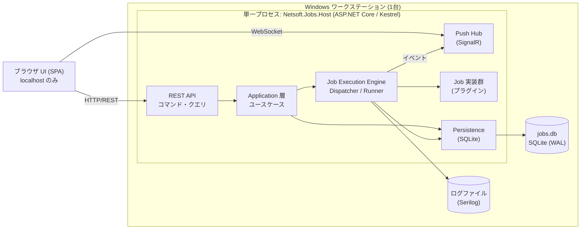

**ポイント**

- ブラウザは操作・表示のみ。ブラウザを閉じても Job は走り続ける。実行主体はあくまでバックエンドプロセス。
- Kestrel は `127.0.0.1` にのみバインドする。権限管理をスコープ外にする以上、ネットワーク境界で守る (→ §13.3)。
- 二重起動は Mutex で禁止する。これは §13.2 の異常終了検出と直結する重要な制約。

### 2.2 レイヤと依存方向

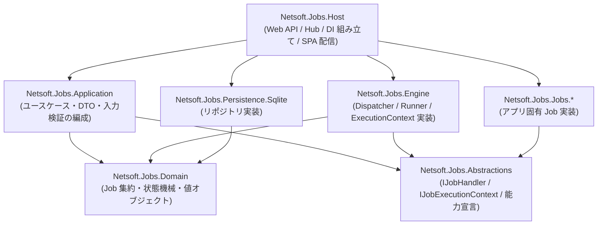

依存規則:

- **Domain は何にも依存しない。** DB にも ASP.NET にも `System.Text.Json` 以外の外部にも依存しない。
- **Job 実装は `Abstractions` にのみ依存する。** Engine にも Domain にも依存させない。これにより「Job を書く人」が知るべき API 面積が最小になり、エンジン内部のリファクタが Job 実装を壊さない。
- **具象の結線は Host にのみ存在する。** どの層も `new` で他層の具象を掴まない。

### 2.3 制御面 / 実行面の分離 (中核概念)

本設計で最も重要な構造。UI 操作と Job 実行の並行性はここで吸収される。

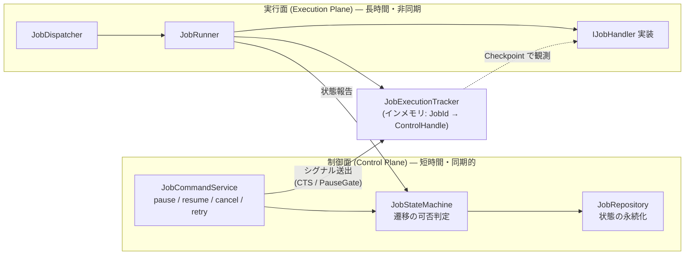

- UI からの Pause/Cancel は **数ミリ秒で完了する**。「要求を記録し、実行中ハンドルにシグナルを立てる」だけだから。Job が数時間かかっていても UI は待たされない。
- 実際の停止は Job 実装が Checkpoint に到達した瞬間に起きる。制御面はそれを**通知として受け取る**。
- `JobExecutionTracker` は永続化しない純粋なインメモリ構造。プロセスが落ちればここは消え、それは仕様上正しい (実行中 Job は失敗扱い)。

---

## 3. ドメインモデル

### 3.1 モデル図

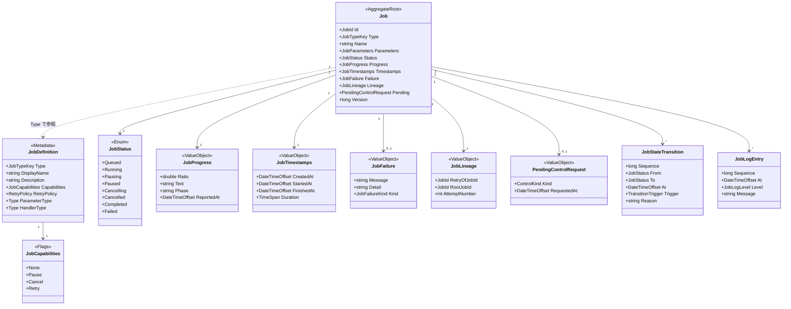

> 図中の型は簡略表記。null 許容の有無は §3.2 の C# 定義と §9.2 のスキーマを正とする。
> `Failure` / `Pending` が任意であることは関連の多重度 `0..1` で示している。

### 3.2 主要概念の説明

#### Job (集約ルート)

1 回の実行要求 = 1 つの `Job`。**Job は不変ではないが、書き換えられるのは実行の進行に伴う属性のみ**で、`Type` / `Parameters` / `CreatedAt` / `Lineage` は生成後に変わらない。

集約の境界は「1 つの Job とその遷移履歴・ログ」。他の Job とはトランザクションを共有しない。これにより Job 単位の楽観ロックが成立する (→ §8)。

#### JobDefinition (Job 型メタデータ)

Job の**型**に紐づく静的情報。DB には持たず、起動時に DI コンテナ上のレジストリとして構築する (コードが唯一の真実)。

DB に Job 型定義を持たせない理由: 型定義とコードが乖離した瞬間に、実行不能な Job が DB に残る。コードから生成すれば必ず整合する。DB には `Type` の文字列キーだけを保存し、キーに対応する定義が失われた Job (旧バージョンの遺物) は「参照専用・操作不可」として一覧に出す。

#### JobCapabilities と「実行可能な操作」

```
宣言された能力 (JobDefinition.Capabilities)   … 静的。Job 型が原理的に何をサポートするか
        ×
現在の状態 (JobStatus)                        … 動的。今その操作が状態遷移として妥当か
        ×
保留中の要求 (PendingControlRequest)          … 動的。競合する要求が既に出ていないか
        ↓
    利用可能な操作 (AvailableOperations)      … サーバが算出し、DTO に載せて UI へ渡す
```

**UI 側でこの判定ロジックを再実装してはならない。** サーバが `availableOperations: ["cancel"]` のように結果だけを返し、UI はそれをボタンの enable/disable にマップする。判定ロジックが 2 箇所にあると必ずズレる。API 側は当然もう一度検証する (UI を信用しない)。

#### JobProgress (進捗)

進捗表現は Job ごとに自由、という要件をそのまま型にする。

```csharp
public sealed record JobProgress(
    double? Ratio,        // 0.0–1.0。不明なら null (不定プログレスバー表示)
    string  Text,         // "120 / 500 件", "装置応答待ち" など、人が読む表現
    string? Phase,        // "ステップ3" のような段階。フィルタ・表示グルーピング用
    DateTimeOffset ReportedAt);
```

- `Ratio` を必須にしない点が肝。「装置応答待ち」に % は存在しない。
- `Text` は必須。UI は常に何か表示できる。
- エンジンは中身を解釈しない。ただ運び、保存し、配信するだけ。

#### JobLineage (再実行の系譜)

再実行は**新しい Job を作る**。元 Job は終了状態のまま一切変更しない (履歴の完全性)。

- `RetryOfJobId`: 直接の親
- `RootJobId`: 最初の Job。UI で「この一連の試行」をまとめて見せるためのキー
- `AttemptNumber`: 1 から始まる通し番号

#### JobFailure

```csharp
public enum JobFailureKind {
    HandlerException,        // Job 実装が例外を投げた
    ParameterValidation,     // 実行時の再検証で失敗
    ProcessTerminated,       // アプリ/PC の異常終了 (起動時に付与)
    HostShuttingDown,        // 正常終了要求に応じられなかった
    HandlerNotFound          // Job 型定義が失われている
}
```

`Message` は利用者向けの短文、`Detail` は診断用 (スタックトレース等)。UI は既定で `Message` のみ表示し、`Detail` は折りたたむ。

---

## 4. 状態遷移モデル

### 4.1 状態一覧

| 状態 | 分類 | 意味 |
|---|---|---|
| `Queued` | 待機 | 作成済み。まだ実行スロットが割り当てられていない |
| `Running` | 実行中 | ハンドラが実行中 |
| `Pausing` | 実行中 (過渡) | 一時停止を要求済み。ハンドラが安全な停止地点に到達するのを待っている |
| `Paused` | 停止中 | 安全な停止地点で停止し、再開シグナル待ち。**実行スロットは保持したまま** |
| `Cancelling` | 実行中 (過渡) | キャンセルを要求済み。ハンドラの終了処理を待っている |
| `Cancelled` | 終端 | キャンセルにより終了 |
| `Completed` | 終端 | 正常終了 |
| `Failed` | 終端 | 異常終了 |

過渡状態 (`Pausing` / `Cancelling`) を独立した状態として持つことが本設計の要。「要求は受理したが、まだ効いていない」を利用者に正しく見せられ、二重要求も自然に弾ける。

### 4.2 遷移図

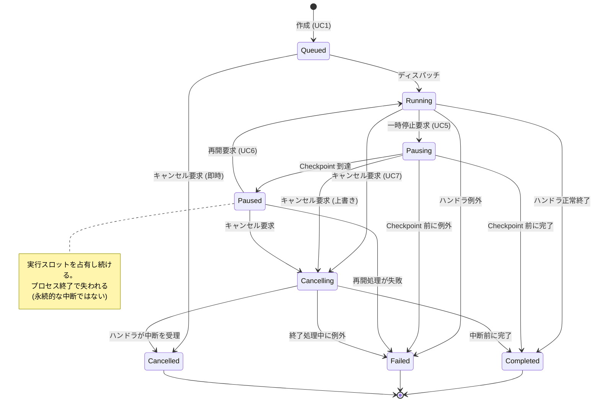

### 4.3 遷移表 (実装上の正)

`(現在状態, トリガ)` → `新状態` の写像。ここに無い組み合わせはすべて不正。

| 現在状態 | トリガ | 前提条件 | 新状態 | 備考 |
|---|---|---|---|---|
| Queued | `Dispatch` | 実行スロット空き | Running | `StartedAt` を記録 |
| Queued | `CancelRequested` | `Cancel` 能力 | **Cancelled** | ハンドラ未起動なので即時終端 |
| Queued | `PauseRequested` | — | ✗ 拒否 | 未実行のものは止められない |
| Running | `PauseRequested` | `Pause` 能力 | Pausing | 保留要求を記録 |
| Running | `CancelRequested` | `Cancel` 能力 | Cancelling | CTS を発火 |
| Running | `HandlerCompleted` | — | Completed | |
| Running | `HandlerFaulted` | — | Failed | |
| Pausing | `CheckpointReached` | — | Paused | ハンドラからの報告 |
| Pausing | `CancelRequested` | `Cancel` 能力 | Cancelling | Cancel が Pause に優先 |
| Pausing | `PauseRequested` | — | ✗ 拒否 (冪等応答) | 既に要求済み |
| Pausing | `HandlerCompleted` | — | Completed | Checkpoint より先に完走した |
| Pausing | `HandlerFaulted` | — | Failed | |
| Paused | `ResumeRequested` | — | Running | PauseGate を開放 |
| Paused | `CancelRequested` | `Cancel` 能力 | Cancelling | Gate をキャンセル付きで開放 |
| Paused | `HandlerFaulted` | — | Failed | 再開時フックの失敗 |
| Cancelling | `HandlerCancelled` | — | Cancelled | |
| Cancelling | `HandlerCompleted` | — | Completed | 中断前に完走。事実を優先する |
| Cancelling | `HandlerFaulted` | — | Failed | |
| Cancelling | `PauseRequested` / `CancelRequested` | — | ✗ 拒否 | |
| 任意の非終端 | `ProcessRecoveryScan` | 起動時のみ | Failed | `Kind = ProcessTerminated` |
| 終端 | 任意の制御トリガ | — | ✗ 拒否 (409) | |

### 4.4 競合ケースの扱い方針

長時間 Job × 並行 UI 操作では、次の競合が**必ず**起きる。方針を先に決めておく。

| 競合 | 方針 | 理由 |
|---|---|---|
| Pause 要求中にハンドラが完走 | `Completed` を採用し、保留要求は破棄。遷移履歴に「要求は無効化された」旨を残す | 実際に起きたことを記録するのが履歴の役目。要求を優先して嘘の状態を作らない |
| Cancel 要求中にハンドラが完走 | `Completed` を採用 | 同上。「キャンセルしたのに完了した」は利用者に正しく伝えるべき事実 |
| Pausing 中に Cancel 要求 | Cancel が勝つ (`Cancelling` へ) | 終了要求の方が強い意図。Pause 待ちで Cancel できないのは操作不能に見える |
| Cancelling 中に Pause 要求 | 拒否 (409) | 終了に向かっているものを止める意味がない |
| 同一操作の二重要求 | 冪等に扱い、現在状態を返す (200) | ボタン連打・再送で 500 を返さない |
| 古い UI 状態からの操作 | `If-Match` (Version) 不一致で 409 + 最新状態を返す | UI は最新を取り直して再判断できる |

### 4.5 状態機械の実装形

```csharp
// Domain 層。副作用なし・IO なし・時刻依存なし (時刻は引数で受ける)。
public static class JobStateMachine
{
    public static TransitionResult Evaluate(
        JobStatus current,
        JobTrigger trigger,
        JobCapabilities capabilities);

    // 利用可能操作の算出も同じ表から導出する (§3.2 の単一の真実)
    public static JobOperations AvailableOperations(
        JobStatus current,
        JobCapabilities capabilities,
        PendingControlRequest? pending);
}

public readonly record struct TransitionResult(
    bool Allowed,
    JobStatus NextStatus,
    TransitionRejection? Rejection);
```

純関数なので、遷移表全体を網羅テストできる (→ §11.1)。

---

## 5. コンポーネント構成

### 5.1 全体図

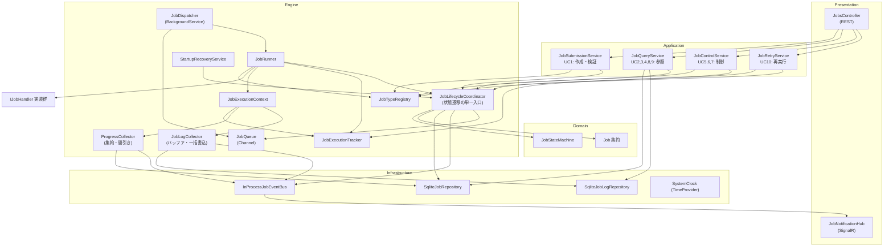

### 5.2 各コンポーネントの責務

| コンポーネント | 責務 | 責務**でない**もの |
|---|---|---|
| `JobTypeRegistry` | Job 型キー → `JobDefinition` の解決。起動時に確定し以後不変 | Job の生成・実行 |
| `JobSubmissionService` | パラメータの型解決・検証・正規化、Job 集約の生成 | 実行順序の決定 |
| `JobControlService` | 制御コマンドの受理。能力・状態の検証 → 状態遷移 → 実行中ハンドルへのシグナル | ハンドラが実際に止まるまで待つこと |
| `JobLifecycleCoordinator` | **すべての状態遷移の単一入口。** ロック取得 → 状態機械評価 → 集約更新 → 永続化 → イベント発行 の定型手順を保証 | 業務判断 (それは状態機械) |
| `JobQueue` | 実行待ち Job の受け渡し (`Channel<JobId>`) | 優先度制御 (今回は FIFO 固定) |
| `JobDispatcher` | 同時実行数の制御、DI スコープ生成、`JobRunner` の起動 | Job の中身 |
| `JobRunner` | 1 実行の全ライフサイクル: 開始遷移 → ハンドラ呼出 → 例外の状態への写像 → 終端遷移 → 後始末 | 状態遷移の可否判断 |
| `JobExecutionContext` | ハンドラに渡す唯一の窓口。Checkpoint / 進捗報告 / ログ出力 | 状態の永続化 (委譲する) |
| `JobExecutionTracker` | 実行中 Job のインメモリ制御ハンドル (CTS + PauseGate + 最新進捗) の保持 | 永続化 |
| `ProgressCollector` | 高頻度の進捗報告を集約し、DB 書込と push を間引く | 進捗の意味解釈 |
| `JobLogCollector` | ログ行のバッファリングと一括書込、上限管理 | ログの整形 |
| `InProcessJobEventBus` | ドメインイベントの配信 (プロセス内) | 配信保証 (best-effort) |
| `StartupRecoveryService` | 起動時に非終端 Job を走査し `Failed(ProcessTerminated)` にする | 自動再実行 |

### 5.3 主要シーケンス

#### 5.3.1 作成 → 実行 → 完了

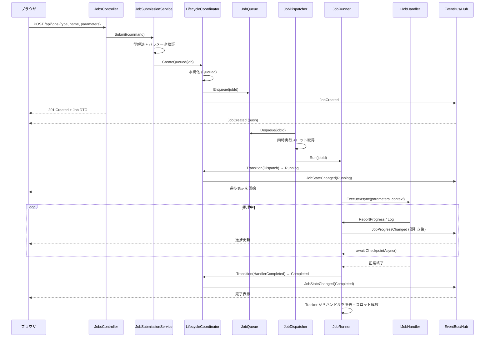

#### 5.3.2 一時停止 → 再開 (UC5 / UC6)

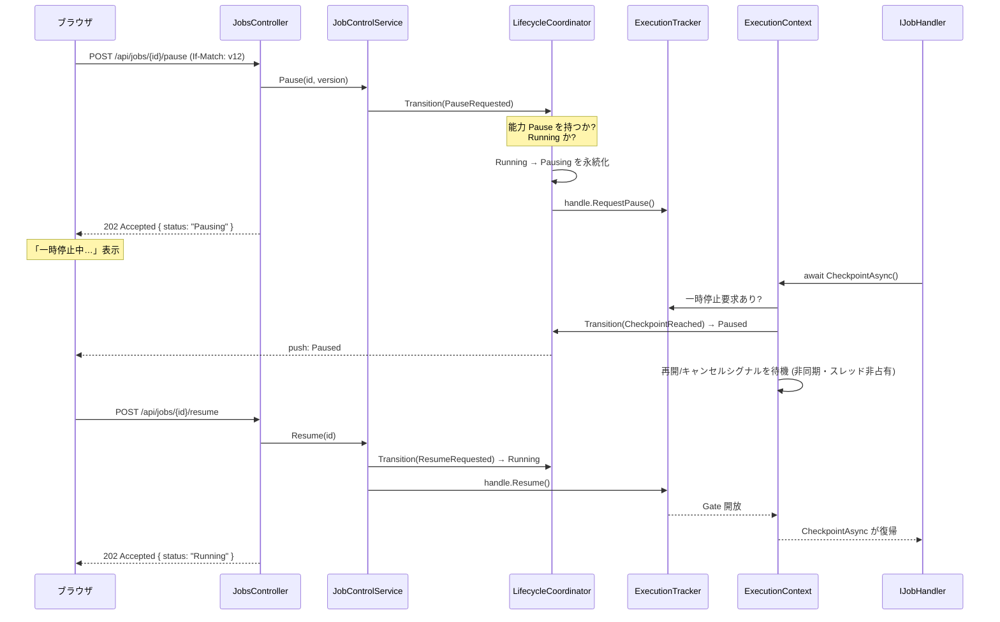

再開時にハンドラ側の再初期化が必要な Job のために、`IPausableJobHandler.OnResumingAsync` を任意実装として用意する (→ §10.2)。「再開方法は Job 実装に依存する」という要件は、このフックで表現する。

#### 5.3.3 キャンセル (UC7)

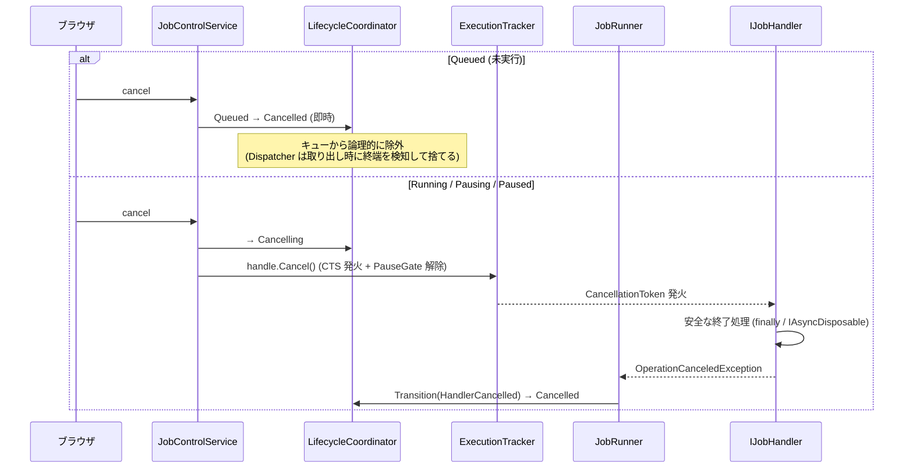

`Queued` のキャンセルでキューから物理削除しないのは、`Channel` から任意要素を抜けないため。Dispatcher が取り出した時点で状態を再読込し、終端なら黙って捨てる (**取り出し時再検証**)。これは並行キューを扱う際の定石で、キュー実装を単純に保てる。

#### 5.3.4 異常終了からの起動 (要件 5)

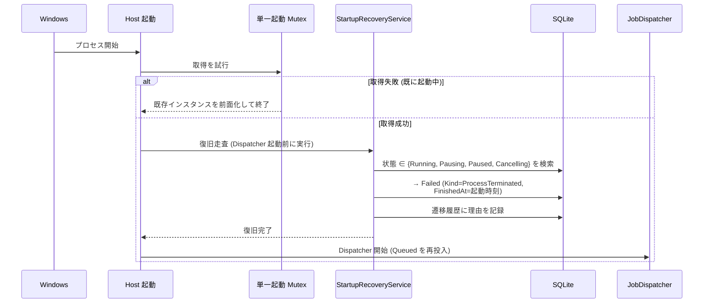

- **Dispatcher より先に復旧を必ず走らせる**。順序が逆だと、復旧対象を新規実行が上書きし得る。
- 二重起動を Mutex で禁じるのが前提条件。禁じないと、2 つ目のインスタンスが 1 つ目の実行中 Job を「異常終了」と誤判定する。この 2 つは必ずセットで実装する。
- `Queued` は `Failed` にせず `Queued` のまま再投入する。まだ何の副作用も起こしていないため、失敗と呼ぶのは不正確。要件の「自動再開しない」は**実行を開始した Job を勝手に続きから再開しない**ことを指すと解釈した (→ ADR-008 で代替案とともに記録)。

---

## 6. Job の拡張方法

エンジンを一切変更せずに Job を追加できることが、この設計の合否を分ける。

### 6.1 Job 実装者が書くもの

```csharp
// 1. パラメータ (POCO)。JSON シリアライズ可能・検証属性つき。
public sealed record CsvImportParameters
{
    [Required, FileExists] public string SourcePath { get; init; } = "";
    [Required]             public string OutputDirectory { get; init; } = "";
    [Range(1, 100000)]     public int    BatchSize { get; init; } = 1000;
}

// 2. ハンドラ。依存はコンストラクタ注入。
[JobType("csv-import",
    DisplayName  = "CSV 取込",
    Capabilities = JobCapabilities.Pause | JobCapabilities.Cancel | JobCapabilities.Retry)]
public sealed class CsvImportHandler : IJobHandler<CsvImportParameters>
{
    private readonly ICsvReader _reader;
    public CsvImportHandler(ICsvReader reader) => _reader = reader;

    public async Task ExecuteAsync(CsvImportParameters p, IJobExecutionContext ctx)
    {
        var rows = await _reader.CountAsync(p.SourcePath, ctx.CancellationToken);
        ctx.Log(JobLogLevel.Information, $"{rows} 件を取り込みます");

        for (var i = 0; i < rows; i += p.BatchSize)
        {
            await ctx.CheckpointAsync();          // ← 安全な停止地点
            await ProcessBatchAsync(i, p, ctx.CancellationToken);
            ctx.ReportProgress(JobProgress.Of(
                ratio: (double)i / rows,
                text : $"{i} / {rows} 件",
                phase: "取込"));
        }
    }
}

// 3. 登録 (Host の DI 組み立て時)
services.AddJob<CsvImportHandler, CsvImportParameters>();
// または アセンブリ走査:
services.AddJobsFromAssemblyContaining<CsvImportHandler>();
```

### 6.2 Job 実装者が書かなくてよいもの

状態遷移 / 永続化 / UI への通知 / 一覧・検索 / ログ保存 / 実行キュー / 同時実行制御 / エラーの状態への写像 / 進捗の間引き / パラメータの入力フォーム (メタデータから自動生成)。

### 6.3 拡張の階層 (必要な分だけ実装する)

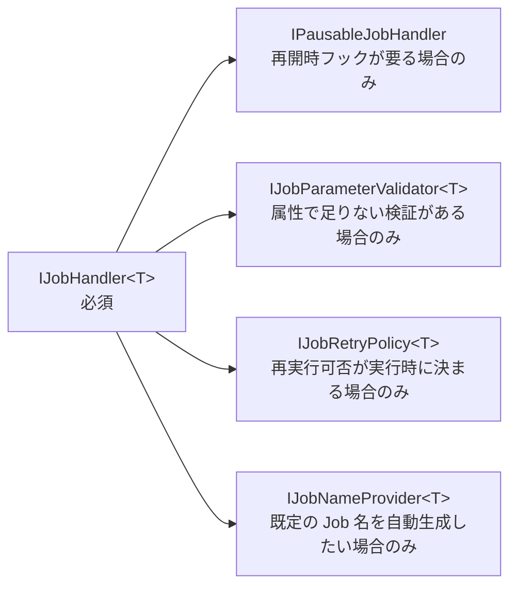

必須は `IJobHandler<T>` ひとつ。他はすべて任意インターフェースで、実装しなければ既定動作になる。「最小の Job は 10 行で書ける」ことを維持する。

### 6.4 能力宣言の実際

| Job の性質 | 宣言 | 補足 |
|---|---|---|
| 純粋な計算・ファイル変換 | `Pause \| Cancel \| Retry` | 全能力 |
| 装置制御 (不可逆) | `Cancel` のみ | 途中停止は装置を不定状態にするため Pause なし。再実行不可 |
| 外部システムへの一括登録 | `Cancel \| Retry` (条件付き) | `IJobRetryPolicy` で「開始前に失敗した場合のみ再実行可」と実行時判定 |
| 一度きりのマイグレーション | `Cancel` のみ | |
| 中断不能な短時間処理 | `None` | 数秒で終わるなら制御機構自体が不要 |

`IJobRetryPolicy<T>` の存在意義: 要件の「一度しか実行できない装置操作」「外部状態を不可逆に変更する Job」は、**静的な型の性質ではなく、その実行がどこまで進んだかに依存する**ことがある。静的宣言だけでは表現できないため、実行時判定のフックを用意する。

```csharp
public interface IJobRetryPolicy<TParameters>
{
    RetryDecision CanRetry(JobRetryContext<TParameters> context); // 元 Job の最終状態・進捗・失敗理由を参照
}
public readonly record struct RetryDecision(bool Allowed, string? ReasonWhenDenied);
```

拒否理由は UI に表示する。ボタンが押せないだけで理由が分からない状態を作らない。

---

## 7. ブラウザ UI と実行エンジン間の通信方式

### 7.1 方式の選定

| 用途 | 方式 | 理由 |
|---|---|---|
| 参照 (一覧・詳細・履歴) | **REST (GET)** | キャッシュ・再取得・ページングが素直。状態の正はここ |
| 操作 (作成・制御・再実行) | **REST (POST) + 202 Accepted** | 制御は非同期に効く。同期的に最終状態を返せないことを HTTP セマンティクスで表現する |
| 状態・進捗・ログの追随 | **SignalR (WebSocket)** | ASP.NET Core 標準、自動再接続・フォールバック込み。数時間の実行を張り付いて見る用途に、ポーリングは不経済 |

**SignalR を選ぶ理由 (対 SSE):** 単一利用者なら SSE でも成立するが、(a) 再接続とバックオフが標準で入っている、(b) Job 単位の購読を Group で表現できる (詳細画面を開いている Job のログだけ流す)、(c) 型付きクライアント (`IJobNotificationClient`) でサーバ側の送信がコンパイル時に検証できる。SSE の優位点は単純さだが、再接続処理を自前で書けば差は消える。→ ADR-005

**ポーリングを主にしない理由:** 進捗が秒単位で変わる長時間 Job に対し、ポーリング間隔は「遅い」か「無駄」のどちらかにしかならない。ただしポーリングは**フォールバックとして残す** (WebSocket 不通時、詳細画面のみ 3 秒間隔)。

### 7.2 押し出しと再同期の設計

push は best-effort と割り切り、欠落しても壊れないようにする。

- すべての Job 通知に `version` (Job の楽観ロック値) を載せる。
- クライアントは保持中の version より小さい通知を捨てる (順序逆転への耐性)。
- 再接続時は push を信用せず、**必ず REST で現在表示中の範囲を取り直す**。
- ログは `sequence` 番号つきで配信し、欠番を検知したら `GET /api/jobs/{id}/logs?afterSequence=N` で埋める。

この「push は通知、REST が正」という割り切りにより、配信保証の作り込みが不要になる。

### 7.3 API 設計

```
# Job 型 (UC1 のフォーム構築)
GET    /api/job-types                     → 型一覧 (キー・表示名・能力)
GET    /api/job-types/{type}/schema       → パラメータの JSON Schema (フォーム自動生成用)

# 作成 (UC1)
POST   /api/jobs                          → 201 + Location + JobDetail
       { type, name?, parameters }        → 400 (検証エラーは項目単位で返す)

# 参照 (UC2, UC3, UC8, UC9)
GET    /api/jobs?type=&status=&createdFrom=&createdTo=&q=&sort=&page=&pageSize=
                                          → JobSummary のページ
GET    /api/jobs/{id}                     → JobDetail (ETag: version)
GET    /api/jobs/{id}/logs?afterSequence= → ログの増分
GET    /api/jobs/{id}/transitions         → 状態遷移履歴 (UC3 のタイムライン)
GET    /api/jobs/{id}/attempts            → 同一 RootJobId の試行一覧 (UC10 の系譜)

# 制御 (UC5, UC6, UC7)
POST   /api/jobs/{id}/pause               → 202 + JobDetail(Pausing)
POST   /api/jobs/{id}/resume              → 202 + JobDetail(Running)
POST   /api/jobs/{id}/cancel              → 202 + JobDetail(Cancelling|Cancelled)
       いずれも If-Match: "{version}" を推奨。不一致は 409 + 最新 JobDetail

# 再実行 (UC10)
POST   /api/jobs/{id}/retry               → 201 + 新しい Job の JobDetail
                                          → 409 (能力なし / ポリシー拒否 + 理由)
```

**エラー応答は RFC 7807 (`application/problem+json`) に統一する。**

```jsonc
{
  "type": "https://netsoft.jobs/errors/operation-not-permitted",
  "title": "この Job は一時停止に対応していません",
  "status": 409,
  "jobId": "01J...", "currentStatus": "Running",
  "availableOperations": ["cancel"]     // UI が即座に再描画できる
}
```

### 7.4 DTO の要点

```jsonc
// JobSummary — 一覧 (UC2)
{
  "id": "01J...", "name": "売上CSV取込 2026-07",
  "type": "csv-import", "typeDisplayName": "CSV 取込",
  "status": "Running",
  "progress": { "ratio": 0.35, "text": "120 / 500 件", "phase": "取込" },
  "createdAt": "...", "startedAt": "...", "finishedAt": null,
  "durationMs": 84213,
  "availableOperations": ["pause", "cancel"],   // ★ サーバが算出
  "version": 42
}

// JobDetail — 詳細 (UC3, UC8) : Summary + 以下
{
  "parameters": { /* 実行時の値。UI は型スキーマと突き合わせて表示 */ },
  "failure": { "kind": "HandlerException", "message": "...", "detail": "..." },
  "lineage": { "rootJobId": "01J...", "retryOfJobId": "01J...", "attemptNumber": 2 },
  "capabilities": { "pause": true, "cancel": true, "retry": false },
  "retryDenialReason": "装置操作は再実行できません"   // 能力はあるがポリシー拒否の場合
}
```

`availableOperations` をサーバが返すこと、`capabilities` と分けて返すことが要点。前者は「今押せるか」、後者は「原理的に対応しているか」で、UI は前者で活性制御し、後者で「この Job は Pause 非対応」というボタン自体の表示可否を決める。

### 7.5 push イベント

```csharp
public interface IJobNotificationClient   // SignalR 型付きクライアント
{
    Task JobCreated(JobSummaryDto job);
    Task JobStateChanged(JobStateChangedDto e);   // status, version, timestamps, availableOperations
    Task JobProgressChanged(JobProgressDto e);    // 間引き済み (既定 4 回/秒/Job 上限)
    Task JobLogAppended(JobLogBatchDto e);        // 詳細画面を開いている Job のみ
}
```

購読粒度: 全体グループ (一覧画面用: 状態変化のみ) と Job 別グループ (詳細画面用: 進捗・ログを含む) の 2 段。一覧を開いているだけで全 Job のログが流れてこないようにする。

---

## 8. 並行処理・排他制御

「利用者は一人」でも並行性は消えない。UI 操作・Job 実行・進捗書込・push 配信がすべて別スレッドで動く。

### 8.1 並行の発生源と対策

| 発生源 | 対策 |
|---|---|
| 複数 Job の同時実行 | `SemaphoreSlim` による同時実行数制限 (既定 1、設定で変更可)。Job 型ごとの上限も設定可能 |
| UI 制御 vs Job 実行 | 制御面はシグナルを立てるだけ。実行面は Checkpoint で観測。共有可変状態を持たない |
| 同一 Job への同時状態変更 | **Job 単位の非同期ミューテックス** + DB の楽観ロック (二重防御) |
| 進捗の高頻度更新 | インメモリに最新値のみ保持し、周期フラッシュ。DB 書込は 1 回/秒/Job まで |
| SQLite への同時書込 | WAL + 単一ライタ直列化 |

### 8.2 Job 単位のロック

```csharp
public interface IJobLockProvider
{
    ValueTask<IAsyncDisposable> AcquireAsync(JobId id, CancellationToken ct);
}
```

`ConcurrentDictionary<JobId, SemaphoreSlim>` による keyed async lock。参照カウントで未使用エントリを回収し、長時間稼働でのリークを防ぐ。

**ロックの中で行うこと (`JobLifecycleCoordinator` の定型手順):**

```
1. Job ロック取得
2. 集約を再読込 (ロック前の情報は信用しない)
3. JobStateMachine.Evaluate(現状態, トリガ, 能力)
4. 拒否なら例外化して即返却 (副作用なし)
5. 集約を更新 (状態・時刻・保留要求・Version++)
6. 永続化 (楽観ロック検証つき) — ここまでが 1 トランザクション
7. ロック解放
8. ★ トランザクション確定後にイベント発行・キュー投入・シグナル送出
```

**手順 8 をロック外・コミット後にすることが要点。** ロック内で push すると、UI がロールバックされうる状態を見る可能性があり、また通知処理の遅延がロック保持時間に直結する。

**ロック内で絶対にやらないこと:** ハンドラの呼び出し、ハンドラの完了待ち、ネットワーク I/O。ロック保持時間は常にミリ秒オーダーに保つ。

### 8.3 一時停止ゲート

```csharp
// 実行中 Job ごとにインメモリで保持される制御ハンドル
internal sealed class JobControlHandle
{
    public CancellationTokenSource Cancellation { get; }
    public bool PauseRequested { get; private set; }

    public void RequestPause();
    public void Resume();                                    // 待機中の Checkpoint を解放
    public ValueTask WaitWhilePausedAsync(CancellationToken ct);  // TaskCompletionSource ベース
}
```

- 一時停止待機は `TaskCompletionSource` による**非同期待機**。`ManualResetEventSlim` などでスレッドをブロックしない。数時間ポーズしてもスレッドプールを 1 本も占有しない。
- `TaskCompletionSource` は `RunContinuationsAsynchronously` で生成する。Resume を呼んだ制御スレッド上でハンドラの継続が走ると、API 応答が Job 処理に巻き込まれる。
- Cancel は `Cancellation.Cancel()` と Gate 解除を同時に行い、待機中の Checkpoint が `OperationCanceledException` で抜けるようにする。「Paused から Cancel できない」を防ぐ。

### 8.4 同時実行数の方針

**既定は 1 (直列実行)。** 理由:

- 対象が単一ワークステーションで、Job には装置制御やファイル I/O が含まれる。並列化すると資源競合が起きやすく、利用者に見える形の非決定性を生む。
- 直列なら「今動いているのはこれ」が自明で、UI も運用も単純になる。

ただし設定で引き上げ可能にし、加えて **Job 型ごとの同時実行上限** (`JobDefinition.MaxConcurrency`) を持たせる。装置制御 Job は全体設定に関わらず常に 1、といった宣言ができる。

```csharp
public sealed class JobEngineOptions
{
    public int MaxConcurrentJobs { get; set; } = 1;
    public TimeSpan ProgressFlushInterval { get; set; } = TimeSpan.FromSeconds(1);
    public TimeSpan ShutdownGracePeriod  { get; set; } = TimeSpan.FromSeconds(30);
    public int MaxLogEntriesPerJob { get; set; } = 10_000;
}
```

### 8.5 正常終了時の扱い

アプリ終了 (利用者が閉じる) は異常終了と区別する。

1. `IHostApplicationLifetime.ApplicationStopping` を捕捉
2. 新規ディスパッチを停止
3. 実行中 Job のうち `Cancel` 能力を持つものへキャンセルを送出
4. 猶予時間 (既定 30 秒) 待機
5. 猶予内に終わったもの → `Cancelled` / 終わらなかったもの・Cancel 非対応 → `Failed(HostShuttingDown)`

これは要件外の追加だが、「毎回の正常な終了が異常終了として記録される」履歴を避けるために必要。閉じるたびに `ProcessTerminated` が並ぶと、本当の異常終了が埋もれる。

---

## 9. 永続化モデル

### 9.1 保存先の選定: SQLite

| 候補 | 判定 |
|---|---|
| **SQLite (Microsoft.Data.Sqlite + EF Core)** | **採用。** サーバ不要の単一ファイル、ACID、SQL による履歴検索 (UC9)、C# からの実績が厚い |
| JSON / CSV ファイル | 却下。クラッシュ時の部分書込に耐えず、検索も自前実装になる |
| LiteDB | 却下ではないが、SQL による柔軟な検索とツールの豊富さで SQLite が優位 |
| SQL Server LocalDB | 却下。単一利用者のワークステーションに対して導入・運用が重い |
| インメモリのみ | 却下。履歴 (UC9) が消える |

→ ADR-006

### 9.2 スキーマ

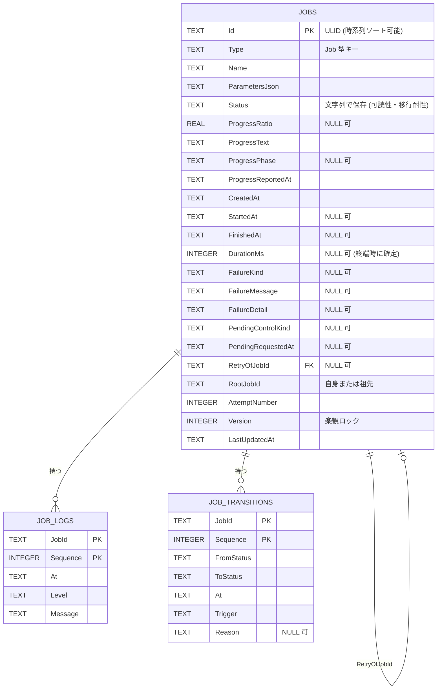

**設計上の判断**

- **`Status` は文字列で保存する。** 数値 enum は DB を直接覗いたときに読めず、値の入れ替えで過去データが壊れる。長期に残る履歴データでは可読性を優先する。
- **時刻はすべて UTC の ISO 8601 文字列。** SQLite に日時型がないため表現を固定し、ソート可能性を保つ。表示時のみローカル時刻へ変換する。
- **`Id` は ULID。** 生成順にソート可能で、`CreatedAt` と併用しなくても安定した順序が得られる。Guid v4 だとインデックスが断片化する。
- **`ParametersJson` は生の JSON で保存する。** Job 型ごとにテーブルを作らない。エンジンがパラメータの構造を知らないという原則の帰結であり、Job 追加時に DB マイグレーションが不要になる。
- **`JOB_TRANSITIONS` を持つ理由。** UC3 の「現在の処理内容」を時系列で見せられ、UC8 の「なぜこの結果になったか」を説明できる。「Cancel を要求したが完了した」といった競合ケースの説明にはこれが不可欠。ログとは別テーブルにするのは、ログは大量・破棄可能、遷移履歴は少量・保全対象という性質差による。

### 9.3 インデックス (UC9 の検索要件から導出)

```sql
CREATE INDEX IX_Jobs_CreatedAt   ON Jobs(CreatedAt DESC);              -- 既定の一覧順
CREATE INDEX IX_Jobs_Status      ON Jobs(Status, CreatedAt DESC);      -- 状態で絞る
CREATE INDEX IX_Jobs_Type        ON Jobs(Type, CreatedAt DESC);        -- 種別で絞る
CREATE INDEX IX_Jobs_Root        ON Jobs(RootJobId, AttemptNumber);    -- 試行系譜
CREATE INDEX IX_Jobs_Active      ON Jobs(Status) WHERE Status IN
    ('Queued','Running','Pausing','Paused','Cancelling');              -- 起動時復旧・実行中一覧
```

最後の部分インデックスが効く: 実行中 Job は常に少数なので、履歴が数万件に育っても起動時復旧と実行中一覧は一定コストで済む。

### 9.4 書込頻度の制御

長時間 Job における最大のリスクは、進捗更新による DB 書込の氾濫。

| データ | インメモリ | DB 書込 | UI push |
|---|---|---|---|
| 状態遷移 | 即時 | **即時・同期** (失われてはならない) | コミット後即時 |
| 進捗 | 即時 (最新値のみ保持) | 周期フラッシュ (既定 1 秒)、および終端時に必ず | 間引き (既定 4 回/秒/Job) |
| ログ | バッファ | 一括書込 (500ms または 200 行) | 詳細画面購読時のみ |

- 進捗は「多少古くても実害がない」データなので間引いてよい。状態は違う。この非対称性を設計に反映する。
- ログのバッファは上限つき (既定 10,000 行/Job)。溢れた場合は古い行を落とし、`"... N 行を省略しました"` のマーカーを残す。**ハンドラをブロックしない** ことを優先する — 診断情報のために業務処理を止めるのは本末転倒。
- プロセスがクラッシュした場合、直近 1 秒の進捗と直近 500ms のログは失われる。その Job はどのみち `Failed` になるため、許容する。

### 9.5 保持ポリシー

履歴は無限には貯めない。設定可能な保持期間 (既定 90 日) を超えた終端 Job を、起動時と 1 日 1 回のバックグラウンド処理で削除する。ログのみ先に消す短い期間 (既定 30 日) も別途持つ — Job 一覧の履歴は残しつつ、容量の大半を占めるログを先に落とせる。

---

## 10. 主要インターフェース設計

### 10.1 Job 実装者向け (`Netsoft.Jobs.Abstractions`)

このアセンブリが**公開 API 面**。Job を書く人はここだけを見ればよい。

```csharp
public interface IJobHandler<TParameters>
{
    Task ExecuteAsync(TParameters parameters, IJobExecutionContext context);
}

public interface IJobExecutionContext
{
    JobId JobId { get; }
    string JobName { get; }
    int AttemptNumber { get; }

    /// 中断・キャンセルの統合トークン。I/O 呼び出しにそのまま渡す。
    CancellationToken CancellationToken { get; }

    /// 安全な停止地点。以下を 1 つの呼び出しで表現する:
    ///  - キャンセル要求あり → OperationCanceledException
    ///  - 一時停止要求あり  → Paused へ遷移し、再開/キャンセルまで非同期待機
    ///  - いずれも無し      → 同期的に即返る (ホットパス)
    ValueTask CheckpointAsync();

    void ReportProgress(JobProgress progress);
    void Log(JobLogLevel level, string message, Exception? exception = null);
}
```

**`CheckpointAsync` を単一の API に統合したことが設計の中心。** Pause と Cancel を別々の API (`ThrowIfCancellationRequested` + `WaitIfPausedAsync`) にすると、Job 実装者は必ず片方を呼び忘れる。「ループの先頭で `await ctx.CheckpointAsync()` を 1 行書く」という単一の規約に集約することで、正しく書くのが最も簡単になる。

戻り値が `ValueTask` なのは、通常時 (要求なし) に割り当てゼロで返るため。数百万回のループ内で呼ばれても問題ない。

```csharp
/// 再開時に再初期化が必要な Job のみ実装する任意インターフェース。
public interface IPausableJobHandler
{
    Task OnPausingAsync(IJobExecutionContext context);   // 停止直前 (接続を閉じる等)
    Task OnResumingAsync(IJobExecutionContext context);  // 再開直前 (接続を張り直す等)
}

public interface IJobParameterValidator<TParameters>
{
    ValueTask<JobValidationResult> ValidateAsync(TParameters parameters, CancellationToken ct);
}

public interface IJobRetryPolicy<TParameters>
{
    RetryDecision CanRetry(JobRetryContext<TParameters> context);
}

[AttributeUsage(AttributeTargets.Class)]
public sealed class JobTypeAttribute : Attribute
{
    public JobTypeAttribute(string key);
    public string  DisplayName { get; init; }
    public string? Description { get; init; }
    public JobCapabilities Capabilities { get; init; }
    public int MaxConcurrency { get; init; } = 0;   // 0 = 全体設定に従う
}
```

### 10.2 アプリケーション層

```csharp
public interface IJobSubmissionService
{
    Task<Result<JobDetailDto>> SubmitAsync(SubmitJobCommand cmd, CancellationToken ct);
}

public interface IJobControlService
{
    Task<Result<JobDetailDto>> PauseAsync (JobId id, long? expectedVersion, CancellationToken ct);
    Task<Result<JobDetailDto>> ResumeAsync(JobId id, long? expectedVersion, CancellationToken ct);
    Task<Result<JobDetailDto>> CancelAsync(JobId id, long? expectedVersion, CancellationToken ct);
    Task<Result<JobDetailDto>> RetryAsync (JobId id, CancellationToken ct);  // 新 Job を返す
}

public interface IJobQueryService
{
    Task<PagedResult<JobSummaryDto>> SearchAsync(JobQuery query, CancellationToken ct);
    Task<JobDetailDto?>              GetAsync(JobId id, CancellationToken ct);
    Task<IReadOnlyList<JobLogDto>>   GetLogsAsync(JobId id, long afterSequence, int take, CancellationToken ct);
    Task<IReadOnlyList<JobTransitionDto>> GetTransitionsAsync(JobId id, CancellationToken ct);
    Task<IReadOnlyList<JobSummaryDto>>    GetAttemptsAsync(JobId rootId, CancellationToken ct);
}
```

`Result<T>` (例外でなく戻り値でエラーを表す) を使う理由: 「能力がないので Pause できない」「状態が合わない」は**異常ではなく想定内の分岐**であり、例外にすると呼び出し側が握りつぶしやすい。予期しない障害だけを例外に残すことで、両者の区別が型に現れる。

### 10.3 エンジン内部

```csharp
public interface IJobTypeRegistry
{
    bool TryGet(JobTypeKey key, out JobDefinition definition);
    IReadOnlyList<JobDefinition> All { get; }
}

/// すべての状態遷移の単一入口 (§8.2 の定型手順を実装する)
public interface IJobLifecycleCoordinator
{
    Task<Result<Job>> TransitionAsync(JobId id, JobTrigger trigger,
                                      TransitionContext context, CancellationToken ct);
    Task<Result<Job>> CreateAsync(NewJob job, CancellationToken ct);
}

public interface IJobExecutionTracker
{
    bool TryGet(JobId id, out JobControlHandle handle);
    JobControlHandle Register(JobId id);
    void Unregister(JobId id);
    IReadOnlyCollection<JobId> RunningJobIds { get; }
}

public interface IJobQueue
{
    ValueTask EnqueueAsync(JobId id, CancellationToken ct);
    IAsyncEnumerable<JobId> DequeueAllAsync(CancellationToken ct);
}

/// 型付きハンドラを非ジェネリックに呼び出すアダプタ。
/// リフレクションをこの 1 箇所に閉じ込め、Runner をジェネリック非依存に保つ。
public interface IJobHandlerInvoker
{
    Task InvokeAsync(JobDefinition definition, string parametersJson,
                     IJobExecutionContext context, IServiceProvider scope);
}

public interface IJobEventPublisher
{
    ValueTask PublishAsync(JobEvent evt, CancellationToken ct);
}
```

### 10.4 インフラ抽象 (テスト差し替え点)

```csharp
public interface IJobRepository
{
    Task<Job?> FindAsync(JobId id, CancellationToken ct);
    Task<PagedResult<Job>> SearchAsync(JobQuery query, CancellationToken ct);
    Task AddAsync(Job job, CancellationToken ct);
    Task UpdateAsync(Job job, long expectedVersion, CancellationToken ct); // 不一致で ConcurrencyException
    Task<IReadOnlyList<Job>> FindNonTerminalAsync(CancellationToken ct);   // 起動時復旧用
}

public interface IJobLogRepository
{
    Task AppendAsync(JobId id, IReadOnlyList<JobLogEntry> entries, CancellationToken ct);
    Task<IReadOnlyList<JobLogEntry>> ReadAsync(JobId id, long afterSequence, int take, CancellationToken ct);
}

// 時刻は TimeProvider (.NET 8+) を使う。独自 IClock を作らない。
// テストでは FakeTimeProvider で経過時間を制御できる。
public interface IJobIdGenerator { JobId NewId(); }
```

---

## 11. テスト容易性

### 11.1 テスト層と対象

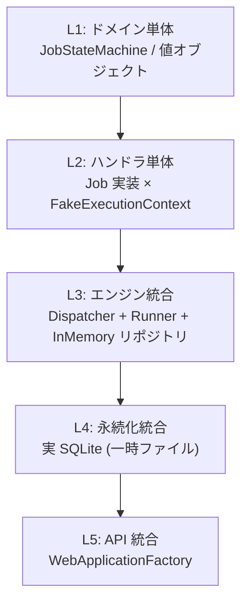

| 層 | 実体 | 検証対象 | 実行時間 |
|---|---|---|---|
| L1 | 純関数 | 遷移表の全網羅、能力算出、進捗値オブジェクト | ミリ秒 |
| L2 | ハンドラ + テストダブル | Job 実装が Checkpoint を呼ぶか、進捗を報告するか、キャンセル時に後始末するか | ミリ秒 |
| L3 | エンジン一式 (DB はインメモリ) | Pause→Paused→Resume、Cancel の各状態からの経路、競合ケース | 秒未満 |
| L4 | 実 SQLite | 楽観ロック、検索クエリ、起動時復旧 | 数秒 |
| L5 | HTTP + SignalR | 409 応答、availableOperations、push の内容 | 数秒 |

### 11.2 テストを可能にする構造上の仕掛け

**(a) 状態機械が純関数**

`JobStateMachine.Evaluate` は IO も時刻も乱数も持たない。8 状態 × 全トリガ × 8 能力組み合わせを総当たりで検証でき、遷移表 (§4.3) をそのままテストデータにできる。仕様変更が起きたら、テストと表と実装が一斉に食い違うので気づける。

**(b) `IJobExecutionContext` がインターフェース**

Job 実装をエンジン抜きで単体テストできる。

```csharp
var ctx = new FakeJobExecutionContext();
ctx.PauseAtCheckpoint(number: 3);           // 3 回目の Checkpoint で一時停止させる
ctx.CancelAtCheckpoint(number: 5);          // 5 回目でキャンセル

await Assert.ThrowsAsync<OperationCanceledException>(
    () => new CsvImportHandler(fakeReader).ExecuteAsync(parameters, ctx));

Assert.Equal(5, ctx.CheckpointCount);
Assert.Contains(ctx.ProgressReports, p => p.Phase == "取込");
Assert.True(fakeReader.Disposed);            // 後始末が走ったか
```

これが Job 実装者にとって最大の価値。**「Pause/Cancel に正しく対応できているか」を DB も HTTP も無しで検証できる。**

**(c) 決定的な同期点**

タイミング依存のテストは `Task.Delay` で書かない。テスト用ハンドラが `TaskCompletionSource` を公開し、テストが「今、Job は Checkpoint の直前にいる」と確定させてから制御コマンドを発行する。

```csharp
var handler = new ControllableJobHandler();   // テスト専用の Job 実装
var jobId   = await engine.SubmitAsync("controllable");
await handler.WaitUntilRunning();             // ハンドラ内部が実行中に入るまで待つ (Delay なし)

await control.PauseAsync(jobId);
Assert.Equal(JobStatus.Pausing, await Status(jobId));   // まだ Checkpoint 前

handler.ReleaseToNextCheckpoint();            // ここで初めて Checkpoint に到達させる
await handler.WaitUntilPaused();
Assert.Equal(JobStatus.Paused, await Status(jobId));
```

`ControllableJobHandler` はテスト基盤として最初に作るべき部品。これがあるかどうかで、競合ケース (§4.4) のテストが書けるかが決まる。

**(d) `TimeProvider` の注入**

実行時間・保持期間・フラッシュ間隔の検証を、実時間を待たずに行える。周期処理は `PeriodicTimer` を `TimeProvider` 経由で生成する。

**(e) 同時実行数の注入**

`MaxConcurrentJobs = 1` にすればディスパッチ順序が決定的になる。並行性そのものを検証したいテストだけ 2 以上にする。

**(f) 抽象化しないもの**

`JobRunner` の内部ステップや `ProgressCollector` の間引きロジックは、L3 の統合テストで観測可能な振る舞い (状態遷移列、DB 書込回数) として検証する。テストのためだけのインターフェースは作らない — 抽象が増えると、テストは通るのに実装が壊れている状態を作りやすい。

### 11.3 最低限そろえるべきテストケース

| # | ケース | 層 |
|---|---|---|
| 1 | 遷移表の全エントリ (許可・拒否とも) | L1 |
| 2 | 能力なしの Job への Pause/Cancel/Retry がすべて拒否される | L1 |
| 3 | Queued の Cancel が即時に Cancelled になる | L3 |
| 4 | Running → Pausing → (Checkpoint) → Paused → Running の完全経路 | L3 |
| 5 | Paused からの Cancel が Cancelling → Cancelled に到達する | L3 |
| 6 | **Pause 要求後、Checkpoint 前に完走した場合 Completed になる** | L3 |
| 7 | **Cancel 要求後、中断前に完走した場合 Completed になる** | L3 |
| 8 | Cancelling 中の Pause 要求が 409 になる | L5 |
| 9 | ハンドラ例外が Failed + FailureMessage に写像される | L3 |
| 10 | 起動時復旧で非終端 Job が Failed(ProcessTerminated) になる | L4 |
| 11 | 起動時復旧が Dispatcher より先に走る | L4 |
| 12 | 楽観ロック不一致が 409 + 最新状態を返す | L5 |
| 13 | 進捗の DB 書込が設定間隔まで間引かれ、終端時には必ず書かれる | L3 |
| 14 | ログが上限を超えたとき古い行が落ちハンドラがブロックしない | L3 |
| 15 | Retry が新 Job を生成し、元 Job が不変であること | L3 |
| 16 | UC9 の検索条件 (種別・状態・作成日時) の組み合わせ | L4 |
| 17 | 再接続後の REST 再取得で UI 状態が一致する | L5 |

6 と 7 (競合ケース) を最初に書くこと。この 2 つが通る設計は、それ以外もだいたい正しい。

---

## 12. ユースケース対応表

| UC | 内容 | 実現手段 |
|---|---|---|
| UC1 | Job を作成する | `GET /api/job-types/{type}/schema` でフォーム生成 → `POST /api/jobs` → 検証 → `Queued` |
| UC2 | Job 一覧 | `GET /api/jobs` (ページング) + `JobStateChanged` push で行を更新 |
| UC3 | Job 詳細 | `GET /api/jobs/{id}` + `/logs` + `/transitions`。`availableOperations` で操作欄を構成 |
| UC4 | 進捗・状態 | `JobProgress` (Ratio 任意 / Text 必須) を `JobProgressChanged` で push |
| UC5 | 一時停止要求 | `POST /pause` → `Pausing` → Checkpoint 到達で `Paused`。能力なしは 409 |
| UC6 | 再開 | `POST /resume` → PauseGate 開放。`IPausableJobHandler.OnResumingAsync` で Job 固有の再初期化 |
| UC7 | キャンセル | Queued は即時 `Cancelled`、実行中は `Cancelling` → ハンドラ終了処理 → `Cancelled` |
| UC8 | 実行結果 | `JobDetail` の status / timestamps / durationMs / failure |
| UC9 | 履歴検索 | `GET /api/jobs?type=&status=&createdFrom=&createdTo=` + §9.3 のインデックス |
| UC10 | 再実行 | `POST /retry` → 能力 + `IJobRetryPolicy` 判定 → 新 Job 生成 (`RetryOfJobId` / `RootJobId`) |
| 要件4 | Job 能力 | `JobTypeAttribute.Capabilities` で宣言、`availableOperations` として UI へ配信 |
| 要件5 | 異常終了 | 起動時に非終端 Job を `Failed(ProcessTerminated)` 化。自動再開なし |

---

## 13. 非機能・運用上の考慮

### 13.1 プロジェクト構成案

```
src/
  Netsoft.Jobs.Abstractions/        Job 実装者向け公開 API (最小・安定)
  Netsoft.Jobs.Domain/              Job 集約・状態機械・値オブジェクト (依存ゼロ)
  Netsoft.Jobs.Application/         ユースケース・DTO・Result
  Netsoft.Jobs.Engine/              Dispatcher / Runner / Context / Tracker
  Netsoft.Jobs.Persistence.Sqlite/  リポジトリ実装・マイグレーション
  Netsoft.Jobs.Host/                Web API / SignalR Hub / DI 組み立て / SPA 配信
  Netsoft.Jobs.Jobs.Sample/         サンプル Job (拡張方法の実例 兼 テスト題材)
  web/                              SPA (一覧 / 詳細 / 作成 / 履歴)
tests/
  Netsoft.Jobs.Domain.Tests/        L1
  Netsoft.Jobs.Engine.Tests/        L2, L3
  Netsoft.Jobs.Persistence.Tests/   L4
  Netsoft.Jobs.Host.Tests/          L5
  Netsoft.Jobs.TestKit/             FakeJobExecutionContext / ControllableJobHandler
```

`Netsoft.Jobs.TestKit` を製品コードと並ぶ第一級の成果物として置く。Job 実装者はこれを参照して自分の Job をテストする。テスト基盤を後付けにすると誰もテストを書かない。

### 13.2 プロセスの単一性

異常終了検出 (§5.3.4) は「実行中 Job があるのに自分が唯一のインスタンスである」ことに依存する。名前付き Mutex (`Global\Netsoft.Jobs.Host`) で二重起動を禁止し、2 つ目の起動時は既存ウィンドウ (ブラウザ) を開いて終了する。この 2 つは分離できない設計上の対。

### 13.3 セキュリティ境界

権限管理をスコープ外とする以上、**ネットワーク到達性そのものを絞る**ことで代替する。

- Kestrel は `http://127.0.0.1:{port}` にのみバインドし、外部 NIC には出さない
- CORS は同一オリジンのみ許可
- Job パラメータのファイルパスは、設定された許可ルート配下かを検証する (パストラバーサル対策)。単一利用者でもプロセス権限で任意ファイルを触れる状態は避ける
- ログ・エラー詳細に認証情報が混ざらないよう、Job 実装者向けガイドに注意を明記する

### 13.4 可観測性

- 構造化ログ (Serilog) をローリングファイルへ。すべてのログに `JobId` を付与する
- 起動時に Job 型レジストリの内容 (キー・能力) を 1 度出力する。「Job が一覧に出ない」の調査が即座に終わる
- `GET /api/health` で DB 接続・実行中 Job 数・キュー長を返す

### 13.5 将来拡張時の影響範囲 (参考)

| 将来要件 | 影響 |
|---|---|
| 日時スケジューリング | Application 層の上に `IJobTrigger` を追加。エンジンは無変更 |
| 成果物ダウンロード | `Job` に成果物メタデータを追加し、保存先を抽象化。エンジンのコアは無変更 |
| 複数ユーザ | `Job.Owner` 追加 + クエリのフィルタ + 認証。状態機械は無変更 |
| Job のプロセス分離 | `IJobDispatcher` の実装差し替え。`IJobExecutionContext` を IPC 越しに実装する必要があり、ここが最大の作業 |
| 自動復旧 | 現状 `Failed(ProcessTerminated)` を付けている箇所を、能力宣言 (`Resumable`) に応じて `Queued` へ戻す判断に置き換える。遷移表に 1 行追加するだけで済む |

いずれも「エンジンが Job の内容を知らない」構造を保っている限り、変更は局所に留まる。
